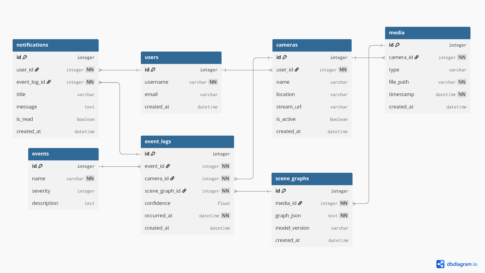

# Sentri: Agentic Video Analysis & Scene Graph RAG

**Sentri** is an intelligent video monitoring, analysis, and conversational system. It integrates the Agno framework, Scene Graph Generation (SGG), and Retrieval-Augmented Generation (RAG) to monitor real-time camera streams as well as perform deep context analysis and chat interactions on pre-recorded video data.

[](https://www.youtube.com/watch?v=VzcdfGM3JfY)
*Check out the [video demo](https://www.youtube.com/watch?v=VzcdfGM3JfY).*

---

## 🏗️ Architecture

The workspace is divided into two distinct but related operational applications:

### 1. `video-analysis-sgg-rag` (Video Pipeline, Vectors & Gradio Chat)
The offline video processing and vector-search engine.
- **Scene Graph Generation (SGG):** Processes raw videos and converts them into structured scene graphs (e.g., `(motorcycle) -[collides_with]-> (person)`).
- **Vector Embedding:** Converts the extracted scene graphs into high-dimensional FAISS embedding vectors.
- **Gradio Web Chat:** Provides a [Gradio web interface](video-analysis-sgg-rag/demo/scripts/gradio_chat_ui.py) where the generated embedding vectors are loaded. Users can interactively chat and ask questions about the video content using a Large Language Model.

### 2. `sentri-ui` (Agentic Real-time Monitor)
The live-stream monitoring and recording application.
- **Real-Time Frame Capture:** Continuously captures live frames from network camera streams (MJPEG, HLS, direct URLs).
- **SGG API Integration:** Requests SGG analysis for the captured frames in real time to detect complex scenarios like traffic collisions.
- **Agentic Engine:** Uses the Agno framework to orchestrate LLM agents for interpreting these scenarios.
- **Database Storage:** Saves the detected event logs, logs, and scene graphs continuously into a database, allowing historical queries and instant threat notifications via the web dashboard.
  <br>

---

## 🚀 Getting Started

### 1. Video Analysis & Gradio Chat (`video-analysis-sgg-rag`)
*Process a pre-recorded video and chat with it.*
1. Navigate to the directory:
   ```bash
   cd video-analysis-sgg-rag
   ```
2. Install dependencies (Requires PyTorch environment matching your CUDA version):
   ```bash
   pip install -r requirements.txt 
   # or pip install -r chatbot_requirements.txt
   ```
3. Run the video pipeline to generate the Scene Graph data and FAISS index. *(See `demo/CHATBOT_README.md` for specific arguments)*.
4. Launch the Gradio Chat Web UI:
   ```bash
   python demo/scripts/gradio_chat_ui.py
   ```

### 2. Live Agentic Monitor (`sentri-ui`)
*Set up the realtime stream system and dashboard.*
1. Navigate to the UI directory:
   ```bash
   cd sentri-ui
   ```
2. Install requirements:
   ```bash
   pip install -r requirements.txt
   ```
3. Initialize the database for SGG storage & queries:
   ```bash
   python db_setup.py
   ```
4. Start the application Web Dashboard:
   ```bash
   python app.py
   ```
   *The server will be available on `http://localhost:7777`*

---

## 🎯 Features

* **Gradio AI Copilot:** Load vector embeddings and ask an LLM natural-language questions about your video using RAG.
* **Continuous Real-Time Monitoring:** Background thread processing auto-captures and queries the camera feed with no manual overhead.
* **Complex Event Detection:** Evaluates SGG relational structures automatically to spot granular events, like a person falling or a traffic collision.
* **Relational Database Logs:** Save stream occurrences and scene facts consistently into a database structure. 

---

## 🤝 Contributing

Contributions, issues, and feature requests are welcome!
